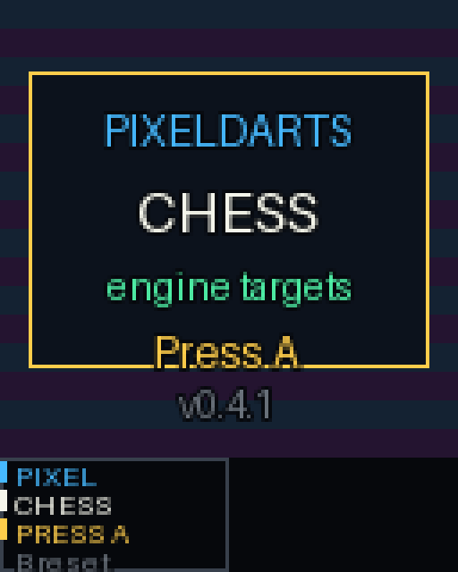
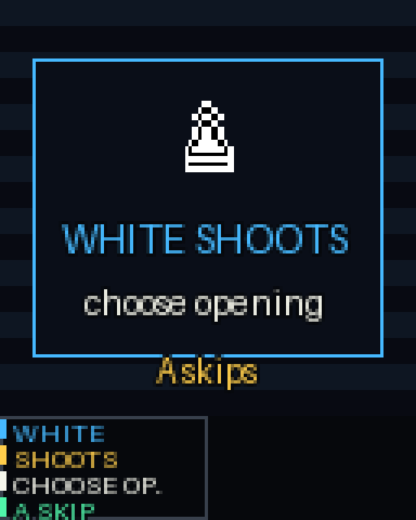
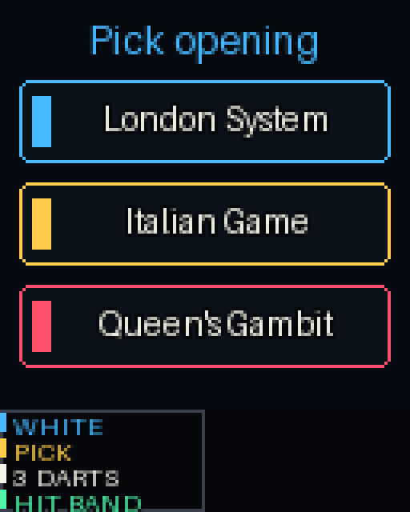
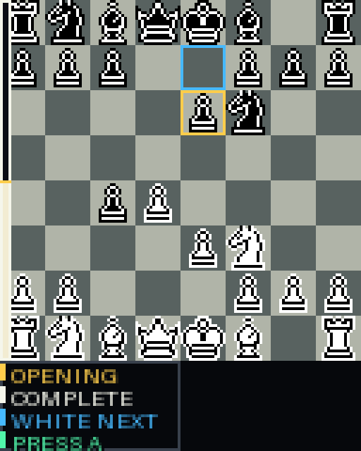

# Dartsnut Widget Tools

Small local tools for building and uploading custom Dartsnut widgets and games.

This repo currently contains:

- `widgets/codex_status_128_128/` - a simple PixelBoard widget.
- `games/pixeldarts_chess_128_160/` - a two-player PixelDart chess game.
- `scripts/upload_widget.py` - uploads a widget to a board over the Dartsnut WebSocket API.
- `scripts/upload_app.py` - uploads either a widget or a PixelDart game.
- `docs/dartsnut-websocket-upload.md` - short notes on the upload flow and emulator setup.

Clone it on another machine:

```bash
git clone https://github.com/feocco/dartsnut-widget-tools.git
cd dartsnut-widget-tools
python3 -m venv .venv
.venv/bin/pip install -r requirements.txt
```

## Upload To PixelBoard

Default target is the PixelBoard we verified on the LAN:

```bash
python3 scripts/upload_widget.py --host 192.168.1.194
```

Dry-run first if you want to see exactly what it will change:

```bash
python3 scripts/upload_widget.py --host 192.168.1.194 --dry-run
```

The uploader writes only to the board's `apps/` directory and updates
`apps/conf.json` so the widget appears as a page named `Codex Status`.

## Upload PixelDarts Chess To PixelDart

PixelDarts Chess is a game, not a widget, so upload it to the PixelDart game
list:

```bash
python3 scripts/upload_app.py \
  --host 192.168.1.250 \
  --app games/pixeldarts_chess_128_160 \
  --cleanup-widget-page
```

PixelDarts Chess uses `python-chess` and prefers a Stockfish binary available
as `stockfish` or via `STOCKFISH_PATH`. It can also use the homelab Stockfish
HTTP service when `STOCKFISH_API_URL` is set, for example:

```bash
export STOCKFISH_API_URL=http://192.168.1.43:8096
```

If no Stockfish service or binary is available, the game uses a simple
material evaluator so the prototype can still run in the emulator.

### Current Beta Gameplay Flow

PixelDarts Chess currently runs as a two-player PixelDart game:

- White chooses an opening family by shooting a horizontal opening band.
- Black chooses the reply package by shooting a reply band.
- The app applies the stored opening line and shows an opening-complete recap
  from White's perspective.
- Normal turns rank legal chess moves with Stockfish when available.
- The dartboard maps colored wedge clusters to exact ranked moves:
  blue = best, green = great, yellow = okay, red = blunder.
- Each player has three dart attempts. Three misses force the blunder move.
- The board rotates for the active shooter during normal play.
- After a move hits, the piece animates, the landed board holds briefly, then
  the board rotates to the next player.

### PixelDarts Chess Preview

These frames are generated from the current game renderer.









## Stockfish Evaluator Image

This repo owns the small HTTP wrapper used by PixelDarts Chess:

```bash
docker build -t ghcr.io/feocco/dartsnut-widgets-stockfish-evaluator:latest services/stockfish_evaluator
docker run --rm -p 127.0.0.1:8096:8096 ghcr.io/feocco/dartsnut-widgets-stockfish-evaluator:latest
```

The game sends the current board state to `POST /rank` as a FEN string:

```bash
curl -s http://127.0.0.1:8096/rank \
  -H 'Content-Type: application/json' \
  -d '{
    "fen": "rnbqkbnr/pppppppp/8/8/8/8/PPPPPPPP/RNBQKBNR w KQkq - 0 1",
    "depth": 8,
    "movetime_ms": 80
  }'
```

The response includes ranked legal moves with `uci`, `san`, `score_cp`, `mate`,
and `rank`. `root_score_cp` and `white_expectation` describe the submitted
position from White's perspective and are used for the board win-probability
bar.

The default `depth=8` is an arcade-speed analysis setting, not an Elo setting.
It is intended to distinguish good moves from obvious mistakes quickly for
casual play. See [services/stockfish_evaluator/README.md](services/stockfish_evaluator/README.md)
for the full API contract and tuning notes.

The image is published by `.github/workflows/stockfish-evaluator-image.yml`.
Runtime Compose config belongs in `feocco/homelab-config`, not in this app
source tree.

## Run In The Emulator

Clone the upstream emulator:

```bash
git clone https://github.com/Dartsnut/dartsnut_emulator.git
cd dartsnut_emulator
python -m venv .venv
source .venv/bin/activate
pip install -r requirement.txt
```

Then run PixelDarts Chess:

```bash
python emulator.py \
  --path /path/to/dartsnut-widget-tools/games/pixeldarts_chess_128_160 \
  --params '{"debug": true, "debug_overlay": false, "stockfish_api_url": "http://192.168.1.43:8096"}'
```

The emulator uses Tkinter, so use a Python install that can open desktop GUI
windows. Press `P` in the emulator to save a screenshot under its `capture/`
folder. Mouse left-click sends a dart, `K` is Button A, and `L` is Button B.
