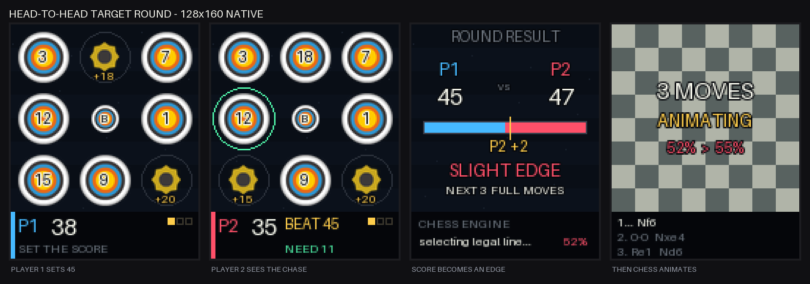
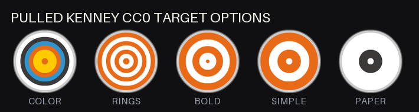
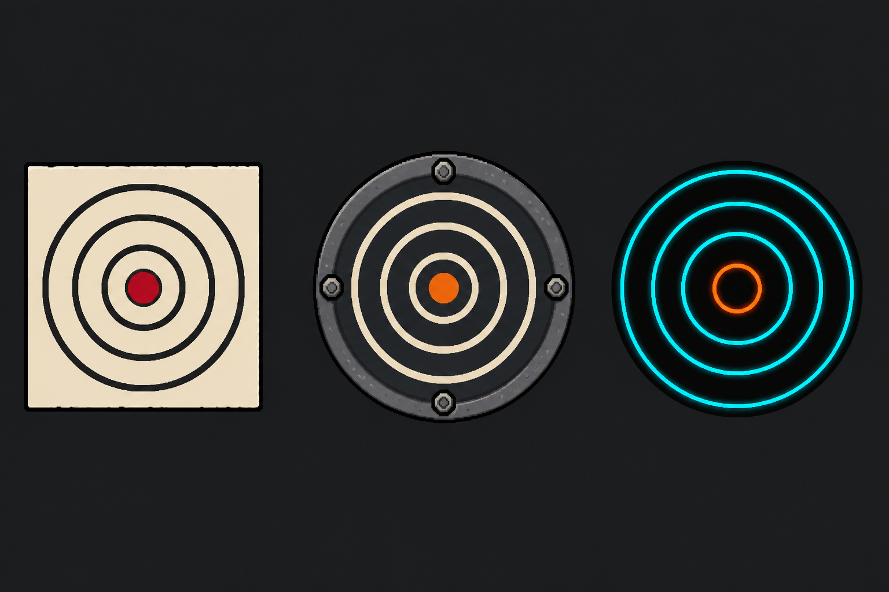

# Head-to-head target round

Status: design only. This document records the decisions made before planning
implementation.

## The game

Players compete in a shooting round for control of the next three full chess
moves. White shoots first in one round, Black shoots first in the next. The
second player sees the first player's final score and the score needed to win.
That pressure is intentional.

After both players finish, the score margin asks the chess engine for a legal
six-ply continuation that favors the round winner. The game animates the pieces
through that line and shows the actual engine win percentage before and after.
The minigame never invents a win percentage.



The first minigame is a simple 3x3 shooting gallery:

- Eight normal targets show unique values sampled from 1 through 20.
- A smaller bull target stays in the center and scores 25.
- Normal targets are 35px across, for roughly 17px of throwing tolerance.
- The bull is 19px across, for roughly 9px of tolerance.
- Each player gets three darts.
- A hit removes that target for the rest of the player's turn.
- A hit in an empty cell or outside a target scores zero.
- The board restores the same targets and values for player two.
- Equal scores go to one-dart sudden death on a fresh shared grid.

The fixed center bull is deliberate. Randomizing it would make the easiest
physical location worth the most points in some rounds and almost nothing in
others. Keeping it centered gives players one stable landmark. Its smaller
hitbox supplies the risk.

## Round generation

A round seed generates the eight normal values and their positions. Sample
eight unique integers from 1 through 20 without replacement, shuffle them into
the outer cells, and put the bull in the center.

The round stores the seed and the resulting layout. It does not regenerate the
layout for player two. Both players see the same values in the same physical
positions.

The total available score changes between rounds because the values change.
Chess advantage therefore uses normalized margin:

```text
margin = abs(player_1_score - player_2_score) / maximum_score_on_this_grid
```

This lets a 12-point lead mean more on a low-value grid than on a high-value
grid.

## Pressure format

Player one sees their score and darts remaining.

Player two sees:

- their current score;
- player one's score to beat;
- the additional points needed;
- darts remaining.

The mockup highlights the cheapest remaining target that would take player two
past the chase score. That hint is not locked. It makes the pressure state easy
to read, but it also plays part of the game for the second shooter. My
preference is to show `NEED 11` without highlighting the 12-point target.

Alternate the first player every round. Showing the chase gives player two an
advantage, and alternating order makes that advantage part of the match rather
than a permanent player advantage.

## From score to chess

The score margin selects an advantage band. It does not select moves directly.

| Normalized margin | Requested result |
| --- | --- |
| tie | most balanced available line |
| up to 10% | slight edge |
| 10% to 25% | clear edge |
| 25% to 40% | strong edge |
| above 40% | strongest allowed edge |

The chess engine searches legal six-ply continuations, scores the resulting
positions, and returns the line closest to the requested result. The response
includes the actual win-draw-loss probabilities. Those are the numbers the UI
shows.

The engine also needs a quality floor. Without one, a large shooting win can
produce absurd chess where a queen hangs for no reason. The exact floor remains
open for tuning. It should cap how much evaluation any single animated move can
lose.

Three full moves means six plies. Calling three plies "three moves" gives one
side two turns and the other only one.

## Module boundaries

The chess code must not know that the contest uses targets, darts, scores, or
players shooting in sequence. The minigame must not know about FEN strings,
legal moves, centipawns, or Stockfish.

```text
Chess position
    |
    v
Match coordinator
    |
    +--> Target round
    |       input: seed, player order, target rules
    |       output: player scores, maximum score, winner, normalized margin
    |
    +--> Chess continuation
    |       input: position, favored side, normalized margin, horizon
    |       output: legal line, before WDL, after WDL, evaluation trace
    |
    +--> Chess animation
            input: starting position and legal line
            output: timed board frames
```

The match coordinator is the only code allowed to translate a minigame result
into a chess request.

### Minigame contract

Every future minigame should produce the same result shape:

```text
RoundResult
  player_scores
  maximum_score
  winner
  normalized_margin
  tie
  round_seed
```

It owns:

- deterministic round generation;
- target geometry and hit detection;
- scoring;
- player order;
- darts remaining;
- its own rendering and sound cues.

It does not import chess packages or call an evaluator.

### Chess continuation contract

The chess side accepts:

```text
ContinuationRequest
  starting_fen
  favored_color
  normalized_margin
  full_moves = 3
  move_quality_floor
```

It returns:

```text
Continuation
  starting_fen
  moves_uci
  moves_san
  before_wdl
  after_wdl
  achieved_margin
  selection_reason
```

It does not know which minigame produced the request.

### Animation contract

Animation consumes an already validated continuation. It never selects,
changes, or repairs a move. If the line is illegal from the supplied position,
the continuation layer failed and the game should stop before animation.

This separation makes each layer testable:

- A seed always produces the same target grid.
- A fixed list of hit coordinates always produces the same score.
- A continuation contains only legal moves from its starting FEN.
- Replaying a continuation reaches the reported final FEN and WDL.
- The coordinator maps score margins to the expected advantage bands.

## Assets

The selected source is
[Kenney's Shooting Gallery pack](https://kenney.nl/assets/shooting-gallery).
It contains separate PNGs, spritesheets, HUD elements, and vector sources under
CC0. The official site was blocked from the cloud agent, so the files in this
repo came from the
[ETdoFresh Kenney mirror](https://github.com/ETdoFresh/kenney.nl). The included
`LICENSE.txt` is the original pack license.



The mockup uses:

- `target_colored_outline.png` for live targets;
- `shot_yellow_large.png` for a popped target;
- `crosshair_white_small.png` as an available future aiming cue.

The other four target PNGs are kept beside them for comparison. The multicolor
target is the recommendation. Its blue, orange, black, and white rings remain
distinct when reduced from 142px to 35px. The thin orange ring target turns
noisy at that size, and the paper target looks like an empty white disc.

I also generated three art directions before pulling the pack:



The paper and steel versions contain too much detail for 35px. The neon version
would survive, but it would be cleaner to draw its rings procedurally than ship
a generated raster. Kenney is the right starting asset for this version.

## Decisions recorded

- Start with one shooting-target minigame.
- Use a 3x3 grid, not 4x4.
- Use eight values from 1 through 20 plus one center bull.
- Score the bull at 25 for the first tuning pass.
- Give each player three darts.
- Remove a target after one hit.
- Restore the exact same seeded grid for player two.
- Show player two the score to beat and points needed.
- Alternate who shoots first each round.
- Resolve ties with one-dart sudden death.
- Compete for three full chess moves, six plies.
- Show the actual engine percentage after selecting the legal line.
- Keep minigame, chess continuation, animation, and coordination separate.

## Still open before implementation planning

- Whether player two gets a visual hint for the cheapest winning target.
- The exact margin bands after playtesting.
- The chess move-quality floor.
- Whether the bull should remain 25 or move to 50.
- Whether a registered bounce-out still counts.
- How long the result and six-ply animation should take.

The largest design risk is repetition. With equal-size normal targets, players
will usually throw at the three highest values. Random placement changes where
they aim but not the decision. The smaller bull adds one choice. If the first
playtest feels solved, vary target size or movement before adding more scoring
rules.
