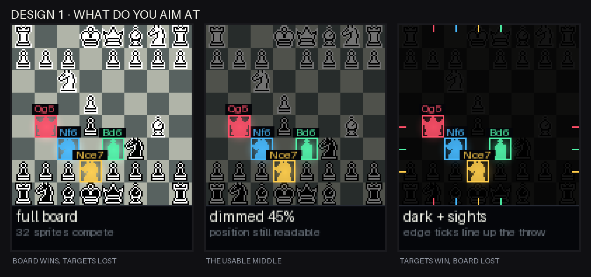
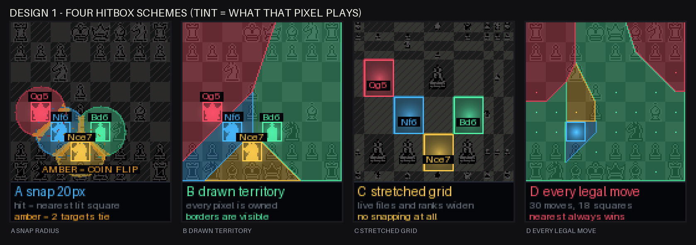
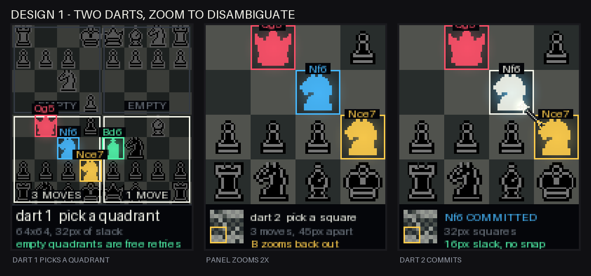
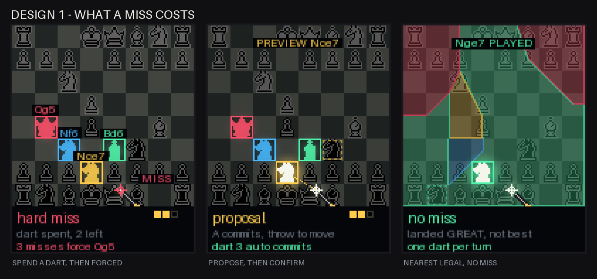

# Design 1: targeting, hitboxes, and misses

Working notes for the live board concept in
[target-concepts.md](target-concepts.md). Nothing here is implemented.

Frames come from `render_targeting.py`, measurements from `target_geometry.py`.

    python3 docs/design/render_targeting.py
    python3 docs/design/target_geometry.py

The sample position is the Ruy Lopez after 1.e4 e5 2.Nf3 Nc6 3.Bb5, Black to
move, with candidates `Nf6`, `Bd6`, `Nce7`, `Qg5`. Move ranking uses a small
local alpha-beta search over the repo's material values, because Stockfish is
not installed in this environment. The buckets are only there to make the
layouts concrete; the shipping game would call the Stockfish service.

## What does the player aim at

A dartboard gives you a bull to aim off. A chessboard is 64 identical squares,
so it gives you nothing: from throwing distance "third file, fifth rank" is not
a thing a human can aim at. The candidate squares have to become the only
landmarks on the panel, which means dimming the position underneath them.

That is a slider, not a setting. At full brightness the 32 piece sprites
out-compete four lit squares. At 8% the targets are unmistakable but you can no
longer read the position you are supposed to be thinking about. Around 45% is
the usable middle.

Edge sights are worth stealing from the dark end regardless: coloured ticks on
all four rails, aligned to each candidate's centre, give the thrower two
crosshairs per target at the panel border where nothing else is competing for
attention.

## Four hitbox schemes

Tint shows what each pixel would play if a dart landed there.

**A, snap radius.** Light the four destination squares, resolve to the nearest
one within 20px, miss beyond that. Simple, and it matches the current
three-darts-then-forced-blunder rule. The amber band is where two candidates are
within 4px of tying, which is a coin flip between a good move and a bad one.

**B, drawn territory.** Same nearest-target rule, but the capture region is
painted instead of hidden, so the whole board belongs to somebody and the
borders are visible. Nothing is secret and there are no misses on the board.
This does not make the targets bigger; it makes them honest.

**C, stretched grid.** Keep exact square hitboxes and no snapping at all, but
give the files and ranks that contain candidates 24px and 30px instead of 16px,
squeezing the rest. The board stays a board, topologically, and every candidate
gets uniform 12px of slack. The layout changes shape every turn, which is either
characterful or disorienting.

**D, every legal move.** Drop the four-candidate abstraction. All 30 legal moves
are live, collapsed onto their 18 destination squares, tinted by quality, and
the nearest one always wins. There is no such thing as a miss: a sloppy throw
gets a worse move. The best move is a small precise target surrounded by
adequate ones, which is the right shape for a chess game.

| scheme | live panel | best-move slack | notes |
| --- | --- | --- | --- |
| current dartboard | 28% | 18.0px | baseline |
| A literal 16px squares | 5% | 8.0px | unthrowable |
| A 20px snap | 19% | 11.2px | assist does not clear the clustering |
| B drawn territory | 80% | 12.2px | visible, not bigger |
| C stretched grid | 14% | 12.0px | uniform, no assist |
| D every legal move | 80% | 10.0px | precision demanded, no misses |
| E zoomed quadrant, dart 2 | 15% | 16.0px | no assist, matches the dartboard |

## The actual blocker is clustering

Every scheme above maps a hitbox to a destination square, so all of them fail in
the same way when two candidates land near each other. That turns out not to be
an edge case. Over 123 random positions, picking one move per quality bucket the
way `build_targets()` does:

| | |
| --- | --- |
| closest pair of candidates, median | 16.0px, exactly one square |
| two candidates on the same square | 28% of positions |
| two candidates on adjacent squares | 44% of positions |
| two candidates within snap range | 67% of positions |

The 28% is fatal on its own. Two different pieces reaching the same square
cannot be told apart by where a dart lands, at any snap radius, with any art.
More than a quarter of turns would need a disambiguation step no matter what.

## The cheap fix

Rather than assisting harder, constrain the selection: require the four
candidates to have destinations at least 32px apart, and take the best-ranked
move in each bucket that satisfies it. Cost of that constraint, same 123
positions:

| | |
| --- | --- |
| positions needing no substitution at all | 56% |
| added centipawn cost, median / p75 / p90 | 0 / 8 / 98 |
| positions losing more than a pawn of quality | 8% |
| buckets with no separated move available | 8%, show three candidates |

That is close to free. Half the time the engine's first choice already
satisfies it, the ninetieth percentile gives up under a pawn, and the failure
mode is showing three targets instead of four. Doing this makes schemes A
through C viable and takes the best-move slack from 11.2px back to roughly
16px without touching the visuals.

The trade is philosophical, not technical: the geometry now has a vote in which
moves get offered. In a sharp position where the three best moves all land on
the same square, the game will offer you a worse move because it is easier to
throw at. Whether that is acceptable depends on whether this is a chess game
with darts or a darts game with chess.

## Two darts and a zoom

The alternative is to stop asking one throw to do the work of two.

The first dart picks a 64x64 quadrant, which is 32px of slack and essentially
unmissable. The panel then zooms 2x into that quadrant, so squares become 32px
and the candidates inside it are 45px apart, and the second dart picks one with
16px of slack and no snapping whatsoever. The bottom strip carries a minimap so
you never lose the whole board. A quadrant with no candidates in it is a free
retry rather than a spent dart.

This is the only scheme that reaches the current dartboard's slack with zero
assist, and it dissolves the same-square problem too, because the natural
version of the first dart is picking the *piece* rather than the quadrant, and
two moves to the same square always come from different pieces.

It also opens the door to dropping the engine from move selection: dart one
picks any of your pieces, the panel repaints with that piece's legal
destinations, dart two commits. That is real chess with darts as the input
device, and the engine goes back to being a commentator.

The cost is pace. Two darts per move roughly halves the number of moves per
session, and the existing three-attempt budget needs rethinking.

## What a miss costs

Same throw, 23px from the nearest candidate, under three policies.

**Hard miss**, today's rule. The dart is spent, and three misses force the
blunder. It is the harshest option and the forced blunder is the part that feels
arbitrary, because it punishes a throwing error with a chess punishment the
player never chose.

**Proposal, then confirm.** Nothing commits on impact. The dart is a cursor: the
panel previews the nearest move as a ghost with the resulting eval, and the
player presses A to commit or throws again to move the cursor. The third dart
auto-commits. This uses `get_active_darts()`, which reports stuck-dart positions
every frame and which no current scene touches. It makes a miss into information
rather than a penalty.

**No miss.** Under scheme D the nearest legal move always plays, so accuracy
degrades move quality instead of failing. In the frame above the stray throw
lands on `Nge7`, still a decent move, which is the honest result: in a quiet
position most of the board is fine and only a few regions are catastrophic. One
dart per turn, no attempt counter, no forced-blunder rule.

## Recommendation

Scheme A or B with the 32px separation constraint and the proposal-confirm miss
policy is the smallest change that makes design 1 throwable, and it keeps the
existing engine-picks-four structure.

Scheme D with no miss concept is the better game. It removes the attempt
counter, the forced blunder, and the arbitrary limit of four moves, and it turns
throwing accuracy directly into move quality, which is the thing this game is
supposed to be about.

The two-dart zoom is the right answer if precision is meant to be the skill,
and it is the only path to full free chess, but it costs pace.

## Things that will bite regardless

Darts physically cover the panel. Three darts and their flights occupy real
estate on a surface that is also the UI, and the live board is the concept most
exposed to this because the board *is* the interface. `get_active_darts()` gives
stuck positions every frame, so the renderer can at least route labels and
previews away from them.

Promotions collapse four moves onto one square, and so do two pieces reaching
the same square, which the destination map currently resolves by keeping the
best-ranked move. That is defensible but it is a silent decision the player
cannot see.

Bounce-outs and dropped darts are real. A dart that reports a hit and then falls
out needs a rejection window before anything commits, which is another argument
for proposal-confirm over commit-on-impact.
