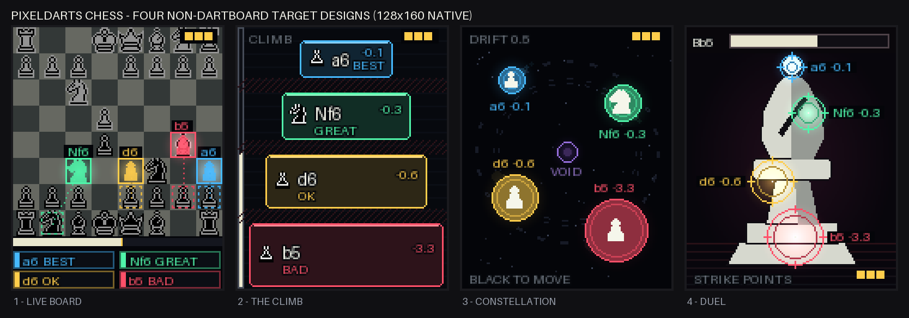
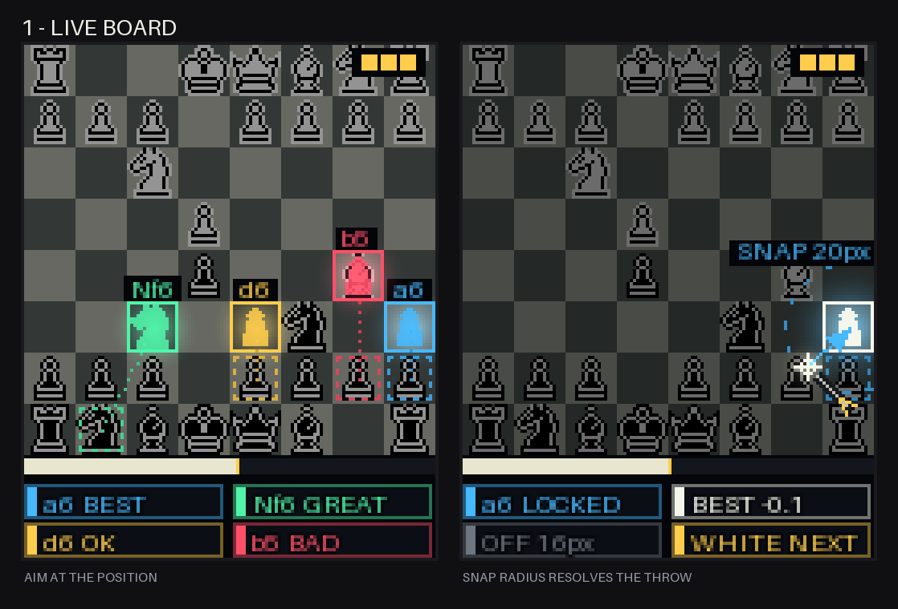
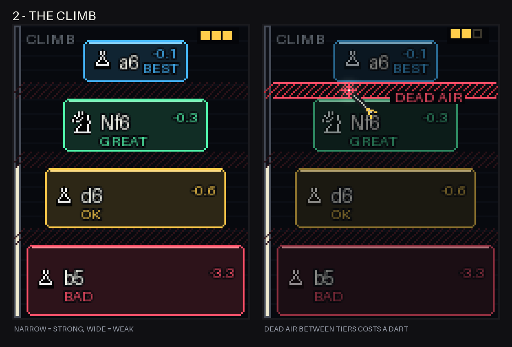
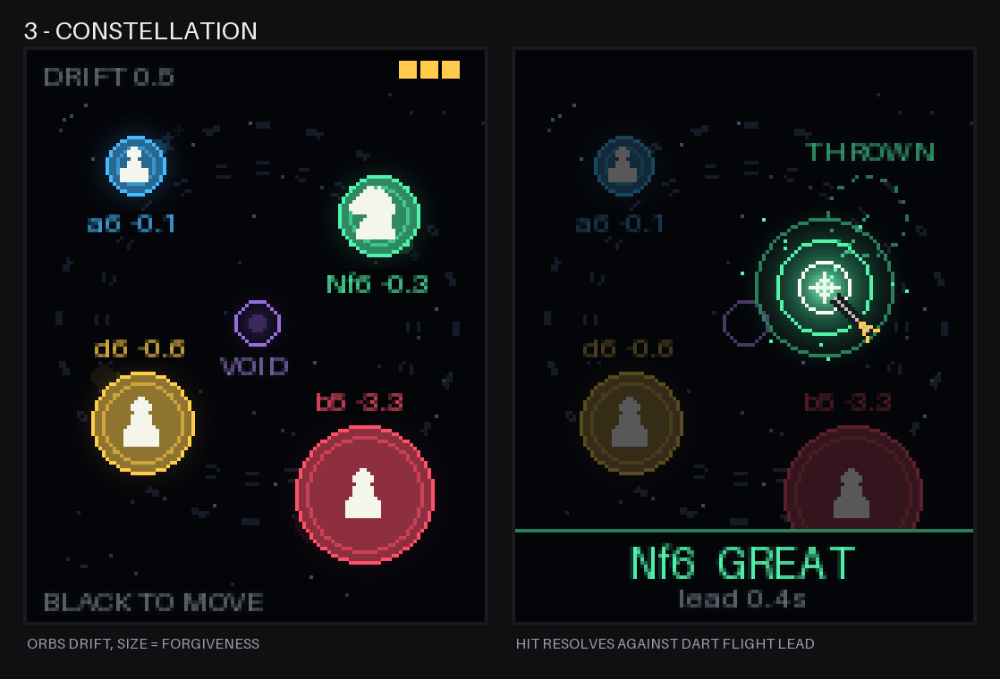
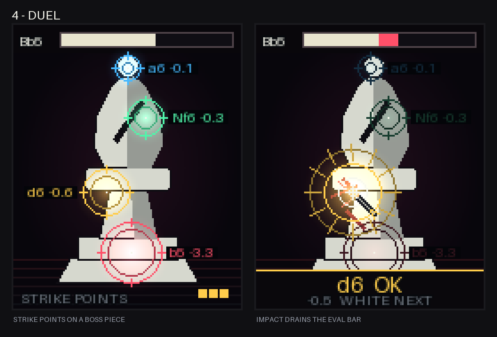

# Four non-dartboard target designs

Drafts only. Nothing here is implemented in `games/pixeldarts_chess_128_160/`.

The current build draws a literal 20-wedge dartboard in `render_dartboard()` and
overlays four quality-colored wedge clusters. That inherits three constraints we
do not actually have:

- The panel is a 128x160 LED screen, not a 451mm sisal disc. Nothing needs to be
  round, and nothing needs 20 sectors when we only ever offer 4 moves.
- Hits arrive from `DartsnutInputAdapter.hit_events()` as raw `(x, y)` pixels, so
  a hitbox can be any shape we can rasterize.
- The dartboard occupies the top 128x128 only, and the bottom strip renders into
  the left 64px. Roughly a third of the panel is dead area.

`get_active_darts()` also reports the position of darts already stuck in the
panel every frame, so a design can react to a dart while it sits there, not only
at the moment of impact. None of the current scenes use that.

## Mockups

All frames are rendered at native 128x160 by `render_concepts.py`, reusing the
game's palette, fonts, and piece sprites, then upscaled 4x for viewing.

    python3 docs/design/render_concepts.py

### 1 - Live board

The position itself is the target. The board dims, and each engine-ranked
candidate lights its destination square in the quality color with a ghost piece,
a dashed trail back to the origin square, and a plated SAN label. You throw at
the square you want to move to.

A 16px square is too small to throw at (8px of slack), so the throw resolves to
the nearest lit destination within 20px and misses outside that. The whole
128x32 strip becomes a horizontal eval bar plus four legend chips instead of a
half-used 64px column.

The natural extension is two-dart moves: the first dart picks one of your pieces,
the panel repaints with that piece's legal destinations, and the second dart
commits. That drops the engine from move selection entirely and turns the game
into real chess where the darts are the input device.

Cost: the four destinations cluster wherever the position is sharp, and the
mockup shows the honest worst case, with `a6` and `b5` one square apart.
Snapping papers over it, but two adjacent candidates will always be a coin flip.

### 2 - The climb

Full 128x160 split into four stacked platforms whose size is inversely
proportional to move quality: the best move is a 56x22 sliver at the top, the
blunder is a 118x38 slab at the floor. Between them are hatched dead-air gaps
that are misses.

This is the only concept where difficulty and chess quality are the same
variable. Today every quality tier has identical 18px slack, so throwing the
best move is exactly as hard as throwing the worst one; the engine's ranking is
decoration. Here the gradient is 12px of slack for the best move up to 20px for
the blunder, so aiming high genuinely risks landing in dead air or dropping a
tier.

Cost: no spatial chess meaning at all, and it is the least interesting to look
at. It reads as a menu, because it is one.

### 3 - Constellation

Bright orbs drifting on a black starfield along faint orbital rings, sized by
forgiveness: the best move is the small fast orb, the blunder is a slow 19px
disc. Each orb carries the piece glyph, its SAN, and its centipawn loss, with a
short motion trail. The dim center ring is a void that rerolls the candidate set
for the price of a dart.

Mostly black pixels is the LED-native choice. It draws less power, it has the
most contrast of the four, and it is the only concept that would read across a
dark room.

Cost: this is the risky one. Dart flight is roughly 300-400ms, so a drifting
target has to be resolved against where the orb was when the dart was released,
not where it is on impact, and the game cannot observe release. The mockup's
second frame shows that lag explicitly. Either the drift stays slow enough to be
cosmetic, or you accept that players learn to lead the target and that becomes
the skill. Do not ship it with fast drift and impact-time resolution; it will
feel broken.

### 4 - Duel

The opponent's most threatening piece fills the panel as a boss. Four strike
points glow on the silhouette, ranked by quality, and an HP bar across the top
is the eval. A hit flashes an impact, cracks the silhouette, and drains the bar
by the eval swing. Between turns the boss morphs into whatever piece is applying
pressure.

This is the largest payoff for owning the whole screen and the most memorable of
the four. It also has the biggest hitboxes per pixel of art, because the
silhouette does the framing work.

Cost: it discards board legibility completely, so it needs a separate review
screen and probably a per-piece painted sprite at ~100px, which is real art
work. The mockup's bishop is drawn procedurally as a placeholder. A full-panel
white silhouette is also the brightest thing in this set, which matters on an
LED panel.

## Geometry

Measured by `target_geometry.py`, which rasterizes every design over the full
panel and computes each target's area and slack, where slack is the radius of
the largest circle fitting inside that target. Slack is the number that decides
whether a throw is fair; area alone is misleading for thin shapes.

    python3 docs/design/target_geometry.py

| design | live panel | best-move slack | blunder slack |
| --- | --- | --- | --- |
| current dartboard | 28% | 18.0px | 18.0px |
| 1 live board, literal squares | 5% | 8.0px | 8.0px |
| 1 live board, 20px snap | 20% | 17.0px | 16.4px |
| 2 the climb | 56% | 12.0px | 20.0px |
| 3 constellation, literal orbs | 11% | 8.4px | 19.2px |
| 3 constellation, 22px snap | 30% | 22.0px | 22.0px |
| 4 duel, literal points | 9% | 7.0px | 17.4px |
| 4 duel, 22px snap | 27% | 19.0px | 21.0px |

Three things fall out of this.

Drawn hitboxes are too small. Live board, constellation, and duel all land at
7-8.4px of slack on the best move, less than half of today's 18px. Any of them
needs bounded nearest-target resolution to be throwable.

Bounded snapping is the right primitive, and it belongs in `dartboard.py`
alongside `classify_dartboard_hit()`. Resolving to the nearest target within a
fixed radius decouples how big a target looks from how big it is, so visual size
can encode risk while the hitbox stays fair. Unbounded nearest-target is the
wrong end of that dial: partitioning the whole panel takes slack to 39-73px and
makes missing impossible.

Only the climb makes quality cost accuracy. It is the one design where the
geometry itself, rather than a color legend, tells you the best move is the hard
one.
